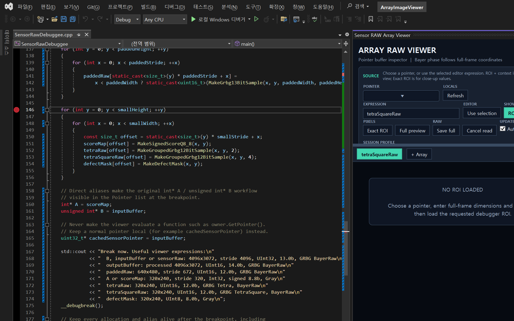
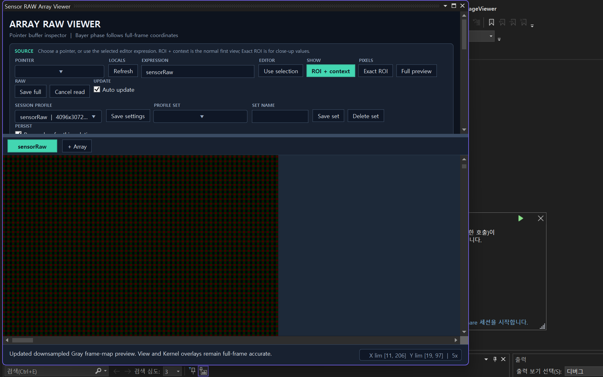
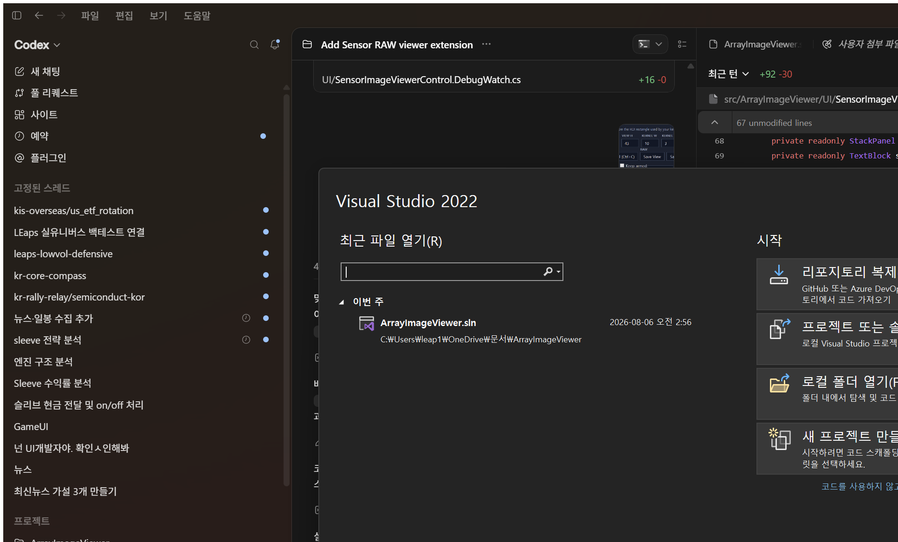
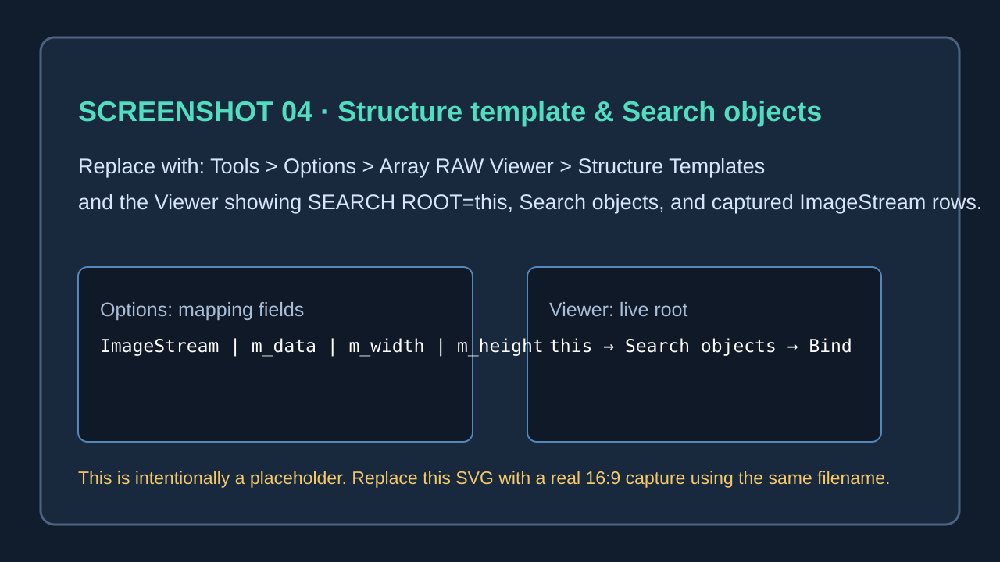
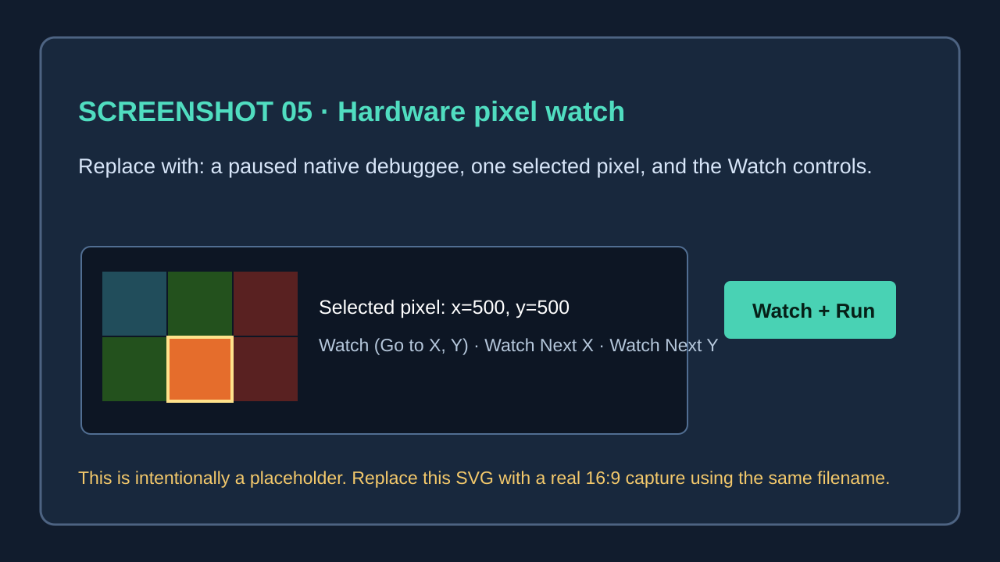

# Sensor RAW Array Viewer

Visual Studio 디버거에서 `int*`, `uint*`, `uint16_t*` 등 **1차원 포인터 버퍼**를 2차원 RAW 이미지로 확인하는 확장입니다. OpenCV 같은 이미지 타입이 없어도 됩니다. 폭, 높이, stride, Q-format, Bayer 해석을 지정하면 현재 디버그 중인 메모리만 안전하게 읽어 표시합니다.

> 좌표 원점은 좌상단 `(0, 0)`입니다. `x`는 오른쪽, `y`는 아래로 증가합니다. Bayer 위상은 확대·이동과 관계없이 항상 전체 프레임 좌표를 기준으로 유지됩니다.

## 빠른 시작

1. [Releases](https://github.com/Longseabear/ArrayRawViewer/releases)에서 최신 `.vsix`를 설치하고 Visual Studio를 다시 시작합니다.
2. `SensorRawDebuggee`를 시작 프로젝트로 선택하고 디버그를 시작합니다. 예제는 `__debugbreak()`에서 멈춥니다.
3. **Tools > Sensor RAW Array Viewer**를 열거나, 코드에서 포인터 표현식을 선택한 뒤 컨텍스트 메뉴의 **Open Sensor RAW Viewer for Selection**을 선택합니다.
4. 포인터를 선택하고 `Width`, `Height`, `Row stride`, `Q format`을 입력합니다. stride는 비워 두면 width와 같게 해석합니다.
5. 먼저 **ROI + context**로 작은 주변 영역을 읽습니다. 픽셀 값을 크게 보고 싶으면 **Exact ROI**를 사용합니다.



*그림 1. 권장 첫 화면: 중단된 C++ 코드, 선택 가능한 포인터, Viewer의 Source 영역이 함께 보이게 캡처합니다.*

## 화면 구성

| 영역 | 역할 |
| --- | --- |
| **Source** | 포인터/표현식 선택, 읽기 방식 선택, 자동 업데이트 설정 |
| **Frame** | 전체 이미지 `Width`, `Height`, `Row stride`, Q-format, 자료형 지정 |
| **View + Kernel** | 선택 좌표와 보이는 View ROI, 주황색으로 표시할 Kernel ROI를 따로 설정 |
| **Array tabs** | 여러 입력/출력 버퍼의 해석과 마지막 화면을 유지하며 전환 |
| **Image viewport** | 확대, 패닝, 픽셀 선택, ROI 지정 |



*그림 2. Viewer 전체 구성. 교체할 때는 Source, 탭, Viewport, 상태 표시줄이 모두 보이는 넓은 화면을 사용하면 좋습니다.*

### 포인터와 프레임 해석

- **Pointer**: 현재 프레임의 포인터 로컬을 목록에서 골라 타입을 자동 적용합니다.
- **Expression**: 목록에 없는 경우 `this->m_data`, `inputBuffer`처럼 직접 입력합니다. 함수형 표현식은 한 번 평가한 주소로 감시할 수 있지만, 반복 평가가 필요 없는 일반 포인터 로컬을 권장합니다.
- **Width / Height**: 실제 이미지의 샘플 개수입니다. 디버거 로컬 `imageWidth` 같은 정수 표현식도 넣을 수 있습니다.
- **Row stride**: 한 줄에 메모리에 존재하는 샘플 개수입니다. 행 패딩이 있으면 width보다 크게 지정합니다. 패딩 영역은 렌더링하지 않습니다.
- **Q format**: `8.8b`, `13.0b` 형식입니다. 앞은 정수부 비트, 뒤는 fractional 비트입니다. 예를 들어 `8.8b`의 저장폭은 16 bit이며 표시값은 `raw / 256`입니다.

## Bayer와 Gray 보기

일반적인 점수맵, loss map에는 **Gray**를 선택합니다. 센서 RAW에는 다음을 독립적으로 조합합니다.

- **Pixel order**: `GRFirst (GRBG)`, `RFirst (RGGB)`, `BFirst (BGGR)`, `GBFirst (GBRG)`
- **Pixel type**: 일반 `Bayer`, 2×2 반복인 `Tetra`, 4×4 반복인 `TetraSquare`
- **Visualize**: `Gray`, 색상 모자이크 `BayerRaw`, `Composite`, 또는 `R/G/Gr/Gb/B` 단일 채널

픽셀 위에 마우스를 올리면 전체 프레임 기준 `x/y`, 원본 정수 raw, Q-format 값, 실제 Bayer site가 표시됩니다.

## ROI, 확대, 이동



*그림 3. View ROI와 Kernel ROI. 교체할 때는 확대된 셀 안의 raw/Q 값, 선택 픽셀, 주황색 Kernel 사각형을 한 화면에 담아 주세요.*

- **Go to X / Y**: 입력을 마치면 그 전체 프레임 좌표가 선택됩니다. **Center view** 또는 이미지 더블클릭으로 선택 픽셀을 뷰 중앙에 둡니다.
- **View W / H**: 실제로 읽고 렌더링하는 범위입니다. 큰 프레임을 빠르게 다룰 때 유용합니다.
- **Kernel W / H**: 알고리즘의 검사 창을 뜻하는 주황색 사각형입니다. View ROI와 별개입니다.
- 이미지에서 **왼쪽 클릭-드래그**: 현재 Kernel 크기를 가진 ROI를 새 위치에 둡니다.
- **Ctrl + 왼쪽 드래그** 또는 **오른쪽 드래그**: Kernel W/H를 드래그 사각형 크기로 바꿉니다.
- **가운데 드래그** 또는 **Shift + 왼쪽 드래그**: 이미 읽어 둔 화면을 패닝합니다.
- 휠, `+/-`, Page Up/Down: 선택 픽셀 또는 마우스 위치 중심으로 확대/축소합니다.

렌더링하지 않은 영역은 다른 색으로 보입니다. 이 영역을 클릭해도 다음 ROI 위치는 고를 수 있지만, 실제 디버거 메모리는 읽기 요청을 실행할 때만 다시 읽습니다.

## 여러 버퍼 비교와 데이터 내보내기

**+ Array**를 누르면 새 탭이 추가됩니다. 각 탭은 포인터, 프레임 해석, View/Kernel ROI, 확대 배율, 스크롤 위치, 마지막 읽기 결과를 별도로 유지합니다. `inputBuffer`와 `outputBuffer`를 같은 좌표에서 비교할 때 사용합니다.

- **Copy kernel (Ctrl+C)**: Kernel ROI를 공백과 줄바꿈으로 구분한 텍스트로 클립보드에 복사합니다.
- **Save View / Save Kernel**: 각각의 ROI를 저장합니다.
- **Save full**: 전체 프레임을 RAW로 저장합니다. 16 bit 이하 포맷은 16-bit RAW, 32 bit 이하는 32-bit RAW로 저장합니다.
- **Session Profile / Profile set**: 포인터별 설정 또는 이름 있는 설정 묶음을 같은 솔루션에 저장합니다. RAW 샘플 자체는 저장하지 않습니다.

## 구조체 템플릿으로 바인딩

프레임워크 구조체를 반복해서 입력하지 않으려면 **Tools > Options > Array RAW Viewer > Structure Templates**에서 형식을 한 번 정의합니다. 템플릿에는 구조체 이름과 멤버 접근 경로만 넣습니다.

```text
Class name   ImageStream
RAW DATA     m_data
WIDTH        m_width
HEIGHT       m_height
```

Viewer에서는 **SEARCH ROOT**에 `this`, `frame`, `ctx->input` 같은 *현재 중단 위치의 실제 표현식*을 넣고 **Search objects**를 누릅니다. `this` 내부에서 등록한 타입만 제한적으로 탐색하므로 전체 Locals/스택을 훑지 않습니다. 후보를 선택한 뒤 **Use captured object**로 바인딩합니다.



*그림 4. 현재는 교체용 자리표시자입니다. Options의 템플릿 행과 Viewer의 `SEARCH ROOT=this → Search objects → 후보 선택` 결과를 함께 캡처해 `04-structure-template-placeholder.svg`를 바꾸면 됩니다.*

## 픽셀이 변경되는 지점에서 멈추기

**Watch (Go to X, Y)**는 선택 좌표의 메모리 주소에 네이티브 데이터 중단점을 하나 만들고 실행을 계속합니다. 해당 픽셀이 변경되면 Visual Studio가 중단합니다.

- **Watch Next X**: `(x + 1, y)`를 감시합니다. 줄 끝이면 `(0, y + 1)`로 넘어갑니다.
- **Watch Next Y**: `(x, y + 1)`를 감시합니다.
- **Clear watch**: Viewer가 만든 감시를 명시적으로 제거합니다. 기본 설정에서는 한 번 멈춘 감시는 자동 해제됩니다. `Keep armed`를 선택하면 다음 변경도 계속 기다립니다.

이 기능은 CPU 하드웨어 데이터 중단점 수를 사용합니다. 사용자가 다른 데이터 중단점을 이미 여럿 설정했다면 만들지 못할 수 있습니다. 중단점은 선택한 **한 픽셀**만 감시하며, ROI 전체를 감시하지 않습니다.



*그림 5. 현재는 교체용 자리표시자입니다. Watch 실행 전 선택 픽셀과 디버거가 해당 픽셀 변경에서 멈춘 모습을 캡처해 `05-hardware-watch-placeholder.svg`를 바꾸면 됩니다.*

## 예제 디버그 시나리오

`samples/SensorRawDebuggee`를 실행하면 다음 데이터가 중단 위치에 준비됩니다.

| 표현식 | 해석 |
| --- | --- |
| `B`, `inputBuffer`, `sensorRaw` | 4096×3072 `UInt32`, `13.0b`, GRBG Bayer input |
| `outputBuffer` | 4096×3072 `UInt16`, `14.0b`, 처리 결과 |
| `paddedRaw` | 640×480 `UInt16`, stride 672, 행 패딩 검증용 |
| `A`, `scoreMap` | signed `Int32`, `8.8b`, Gray score map |
| `tetraRaw`, `tetraSquareRaw` | 320×240 `UInt16`, `12.0b`, Tetra/TetraSquare 검증용 |
| `defectMask` | 8-bit Gray mask |
| `imageSimulator` | `ImageStream` 직접 멤버, vector, 배열 탐색 예제 |

## 스크린샷 교체 목록

문서의 이미지는 `docs/images/`에 있습니다. 같은 파일명으로 바꾸면 본문을 수정할 필요가 없습니다.

| 파일 | 현재 상태 | 교체할 때 포함하면 좋은 내용 |
| --- | --- | --- |
| `01-editor-and-viewer.png` | 임시 실제 캡처 | 중단된 C++ 코드, 선택한 포인터, Source 설정 |
| `02-viewer-overview.png` | 임시 실제 캡처 | 탭, View/Kernel 설정, 확대된 이미지, 하단 상태 |
| `03-viewport-and-kernel.png` | 임시 실제 캡처 | 픽셀 raw/Q 텍스트, 주황색 Kernel, 선택 좌표 |
| `04-structure-template-placeholder.svg` | 자리표시자 | Options 템플릿과 Viewer Search objects의 성공 결과 |
| `05-hardware-watch-placeholder.svg` | 자리표시자 | Watch 시작 버튼과 픽셀 변경에서 중단된 디버거 |

## 문제 해결

- **Pointer 목록이 비어 있음**: 디버그가 중단(Break) 상태인지 확인하고 **Refresh**를 누릅니다. 직접 Expression을 입력해도 됩니다.
- **`ImageWidth` 같은 식을 찾을 수 없음**: 해당 이름이 현재 스택 프레임의 로컬인지 확인합니다. 다른 스코프의 값은 `this->ImageWidth`처럼 명시합니다.
- **Bayer 색이 이상함**: Pixel order는 전체 센서 좌상단 기준입니다. 잘라 낸 ROI의 좌상단을 새 `(0,0)`로 취급하지 마세요.
- **전체 프리뷰가 느림**: 4096×3072처럼 큰 프레임은 먼저 ROI + context로 확인한 뒤 필요한 경우에만 Full preview를 사용합니다.
- **Watch를 만들 수 없음**: 기존 Visual Studio 데이터 중단점을 줄이거나 **Clear watch** 후 디버그가 다시 Break 상태가 될 때까지 기다립니다.

---

문서 소스: [Longseabear/ArrayRawViewer](https://github.com/Longseabear/ArrayRawViewer) · 문제/제안은 GitHub Issues에 남겨 주세요.
